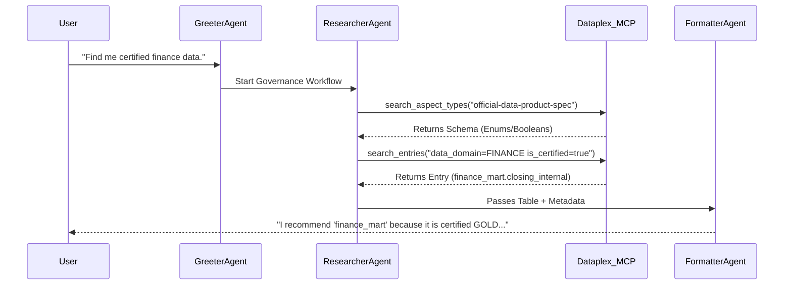

# System Architecture: Governance-Aware GenAI Agent

This document provides a deep dive into the technical architecture of the Intelligent Data Governance project. It explains how Dataplex metadata is used to enforce strict context boundaries for LLM-based agents.

---

## 1. High-Level Concept: "Governance-as-Context"

The core innovation of this project is the **Deterministic Reasoning Loop**. Instead of allowing an LLM to search broadly for data, we force it to first consult the "Book of Rules" (Dataplex Aspect Types) and then search using the specific criteria defined by those rules.

### Key Architectural Pillars:
*   **Metadata Sovereignty:** The Dataplex Catalog is the single source of truth for what data is "trusted."
*   **Zero-Trust Retrieval:** Agents are denied access to table lists by default; they must discover assets via governed metadata.
*   **Explainable Compliance:** The agent must justify every recommendation based on specific governance "Aspects."

---

## 2. Infrastructure Layer (The Data Foundation)

Managed via **Terraform**, the environment simulates a realistic enterprise data lake with varying levels of quality and governance.

### BigQuery Layout:
| Dataset | Governance Level | Intent |
| :--- | :--- | :--- |
| `finance_mart` | **High** | GOLD tier data, strictly certified for public/internal use. |
| `marketing_prod` | **Medium** | SILVER tier data, realtime streams for internal optimization. |
| `analyst_sandbox` | **None** | BRONZE tier data, ad-hoc dumps, NOT certified. |

### Dataplex Governance Template:
The `official-data-product-spec` Aspect Type defines the mandatory metadata schema:
*   `product_tier` (Enum): GOLD, SILVER, BRONZE.
*   `data_domain` (Enum): FINANCE, MARKETING, LOGISTICS.
*   `usage_scope` (Enum): INTERNAL_ONLY, EXTERNAL_READY.
*   `is_certified` (Boolean): The critical "Trust Stamp."

---

## 3. Governance Automation Workflow

The project simulates an automated governance pipeline where data is "stamped" with metadata as it moves through the lake.

1.  **`generate_payloads.sh`**: Translates the Dataplex Aspect Type schema into table-specific YAML payloads (`aspect_payloads/`).
2.  **`apply_governance.sh`**: Uses the `gcloud dataplex entries update` command to attach these payloads to the BigQuery Entry IDs in the Dataplex Universal Catalog.

---

## 4. Agent Orchestration Layer

The production agent is built using **Google's Agent Development Kit (ADK)** and the **Model Context Protocol (MCP)**.

### Sequential Agent Design:
We use a `SequentialAgent` workflow to separate "Research" from "Reporting."

#### Phase A: The Governance Researcher (Tool-Enabled)
*   **Role:** Performs the technical discovery.
*   **Tools:** `search_aspect_types`, `search_entries`, `lookup_entry`.
*   **Logic:**
    1.  **Schema Lookup:** Calls `search_aspect_types` for "official-data-product-spec".
    2.  **Syntax Mapping:** Maps user intent (e.g., "Official") to boolean `is_certified=true`.
    3.  **Discovery:** Executes a filtered Dataplex search.

#### Phase B: The Compliance Formatter (Narrative)
*   **Role:** Translates technical metadata into a human-readable recommendation.
*   **Logic:** Explains the "Why" (e.g., "I recommended this table because it is tagged as GOLD tier and is_certified is true").

---

## 5. Request Flow Sequence

---

## 6. Security & Guardrails

*   **Read-Only Scope:** The MCP server is configured with a read-only Dataplex source. The agent cannot modify metadata or delete tables.
*   **Context Injection:** The `GEMINI.md` and `agent.py` instructions act as "Hard System Prompts," preventing the agent from deviating from the 3-phase algorithm.
*   **Hallucination Prevention:** If a Dataplex search returns zero results, the Researcher Agent is instructed to fail explicitly rather than guessing a table name.
